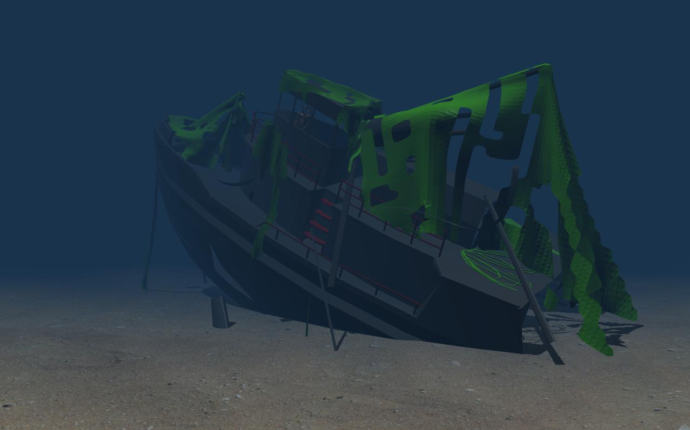
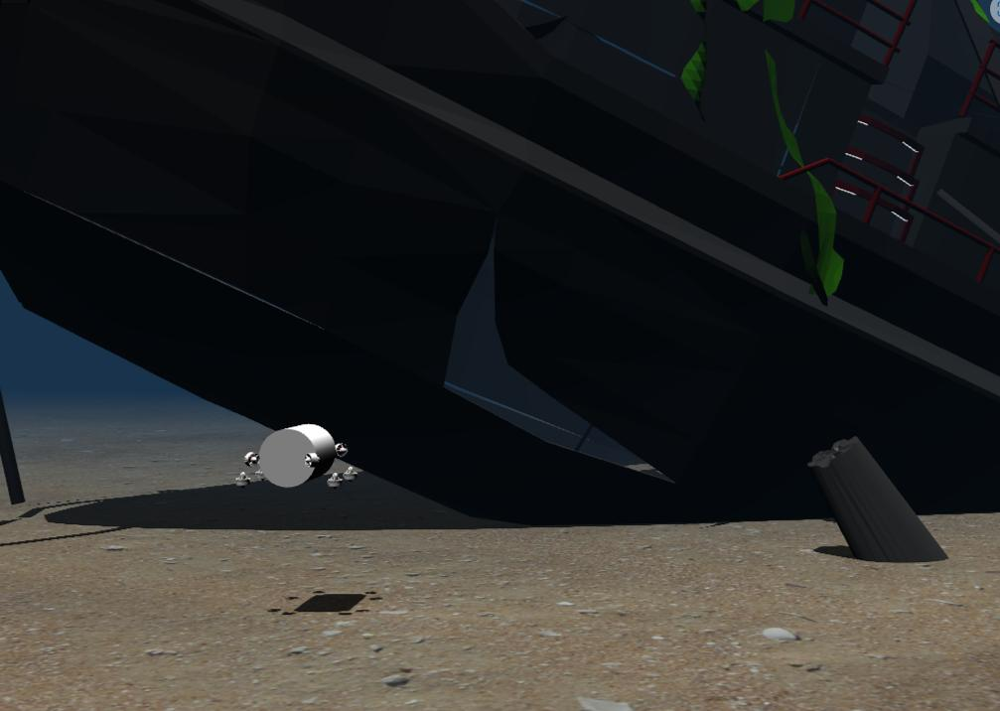
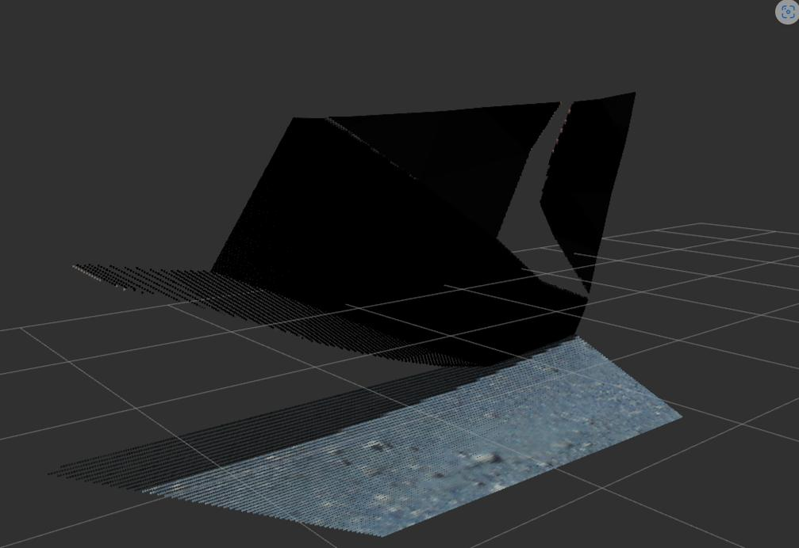
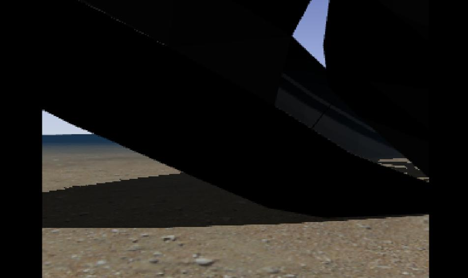
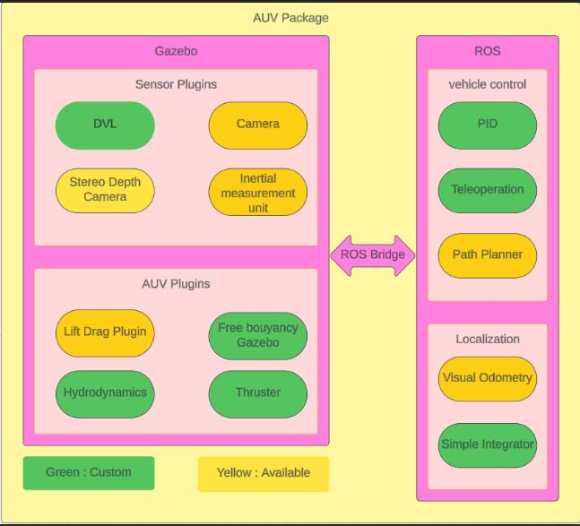
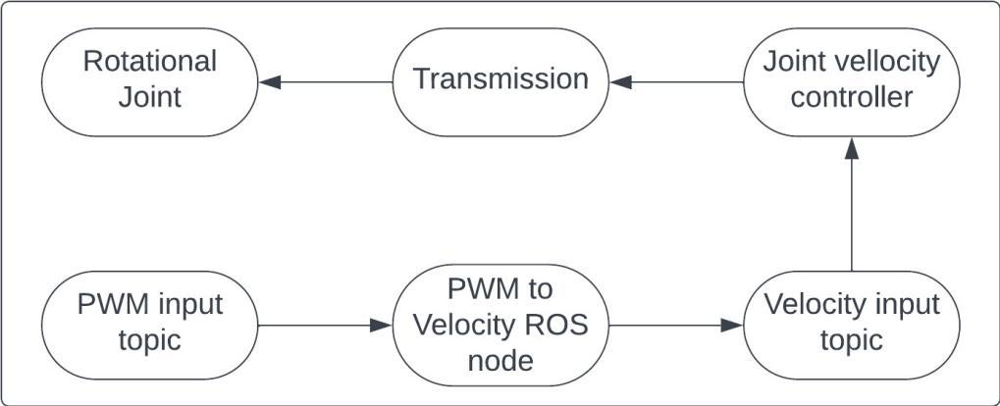
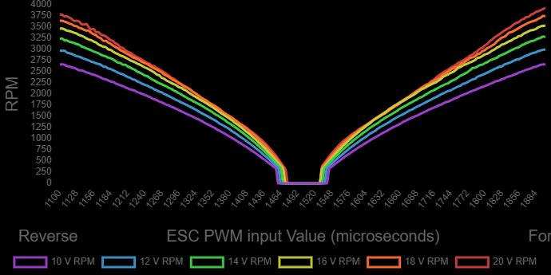
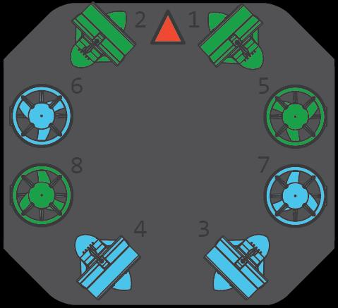
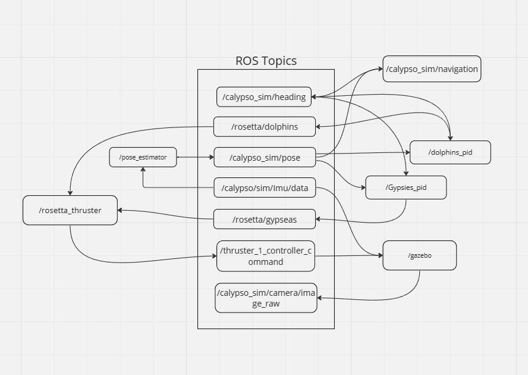

# 🧭 Calypso-Sim: An Autonomous Underwater Vehicle Simulator

**Calypso-Sim** is an open-source ROS and Gazebo-based simulator for autonomous underwater vehicles (AUVs). It provides a comprehensive, modular, and customizable platform for developing, testing, and validating underwater robotics software — all without needing real-world sea trials.









## 🌊 Key Features

- **Full ROS Integration**: Custom thruster control messages and topic structure.
- **Realistic Sensors**: Stereo Depth Camera, 2D Camera, IMU, Doppler Velocity Logger.
- **Physics Simulation**: Buoyancy, lift/drag, and thruster dynamics using Gazebo plugins.
- **Teleoperation**: Manual control using game controllers via rosserial.
- **Modular Design**: Easy to test individual components or swap control logic.


## 🧭 Architecture Overview


*High-level architecture of Calypso-Sim showing sensor, control, and localization modules.*

---

## 🔧 Thruster Control System


*Thruster pipeline from PWM input to Gazebo RPM control.*


*Mapping between PWM and RPM using BlueRobotics T200 profile.*

---

## 🔄 Thruster Configuration


*8-thruster layout enabling 6-DOF control for the AUV.*

---

## 🔌 ROS Communication Architecture


*ROS topic graph for Calypso-Sim communication across control, sensors, and actuation.*


## 📦 Repository Structure

```
calypso-simulator/
├── launch/                  # Launch files
├── models/                  # URDF + mesh files
├── scripts/                 # Control and conversion scripts
├── worlds/                 # Gazebo environments
├── urdf/                    # AUV and sensor descriptions
├── config/                  # PID + thruster settings
├── msg/                     # Custom ROS messages
└── Calypso_simulator.pdf    # Project architecture and report
```

## 🛠️ Getting Started

### Prerequisites

- ROS Noetic or ROS 2 Foxy+
- Gazebo 11+
- rosserial
- BlueRobotics Buoyancy Plugin

### Installation

> ✅ Tested on **ROS Noetic** with **Gazebo 11**

```bash
# Clone into your catkin workspace
git clone https://github.com/Dreadnought-Robotics/calypso-sim ~/calypso_ws/src/
cd ~/calypso_ws
catkin_make
source devel/setup.bash
```

### Dependencies

```bash
sudo apt install ros-noetic-joint-state-publisher-gui
sudo apt-get install ros-noetic-controller-manager
sudo apt-get install ros-noetic-joint-state-controller
sudo apt-get install ros-*controller*  # installs all controllers
sudo apt-get install ros-noetic-gazebo-ros-pkgs ros-noetic-gazebo-ros-control
```


```bash
git clone https://github.com/Dafodilrat/calypso-simulator.git
cd calypso-simulator
mkdir -p ~/calypso_ws/src
mv calypso-simulator ~/calypso_ws/src/
cd ~/calypso_ws
catkin_make
source devel/setup.bash
```

### Launching

```bash
roslaunch calypso_simulator calypso.launch
```

## 🚀 ROS Topics

| Topic | Type |
|-------|------|
| `/rosetta/gypseas` | `calypso_msgs/gypseas` |
| `/rosetta/dolphins` | `calypso_msgs/dolphins` |
| `/thruster_1_controller/command` | `std_msgs/Float64` |
| `/calypso_sim/heading` | `geometry_msgs/Quaternion` |
| `/calypso_sim/pose` | `geometry_msgs/Quaternion` |
| `/calypso_sim/imu/data` | `sensor_msgs/Imu` |
| `/calypso_sim/camera/image_raw` | `sensor_msgs/Image` |

## 📌 Future Work

- SLAM and underwater mapping
- GUI-based mission planner
- Sonar and manipulator support
- Batch simulation for RL training

## 📜 Citation

If you use this simulator in your research, please cite:

> Shell, M., Doe, J., & Doe, J. (2025). *Calypso-Sim: An Autonomous Underwater Vehicle Simulator*. [PDF](Calypso_simulator.pdf)

## 📬 Contact

Please use [GitHub Issues](https://github.com/Dafodilrat/calypso-simulator/issues) for bugs or feature requests.
